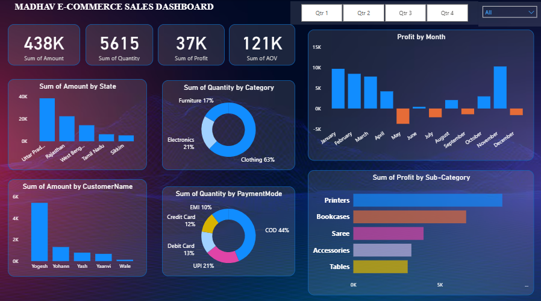

# 📊 Madhav E-Commerce Sales Dashboard

An interactive **Power BI dashboard** for visualizing the sales performance of Madhav Store. This dashboard highlights key business metrics, trends, and insights to support data-driven decisions.

## 🖼️ Dashboard Preview

  

## 📌 Features

- **📈 Key KPIs:**
  - Total Sales Amount (₹438K+)
  - Total Quantity Sold (5615)
  - Total Profit (₹37K+)
  - Average Order Value (₹121K)

- **📍 Regional Insights:**
  - Sales performance by state (e.g., UP, Rajasthan, Tamil Nadu)

- **📦 Product Category Breakdown:**
  - Sales quantity by categories: Clothing, Electronics, Furniture
  - Profit by sub-categories: Printers, Sarees, Bookcases, etc.

- **📅 Monthly Trends:**
  - Monthly profit visualization
  - Quarterly filters for time-based analysis

- **💳 Customer & Payment Analysis:**
  - Top-performing customers
  - Payment mode distribution: COD, UPI, Credit/Debit Card, EMI

## 🧰 Tools Used

- 📊 **Microsoft Power BI**
- 🧮 Data modeling in Power Query
- 🧠 DAX for calculated columns and measures
- 🎨 Visuals: KPIs, bar charts, pie charts, filters & slicers

## 🚀 How to Use

1. Download the `.pbix` file (if available) from this repository.
2. Open in [Power BI Desktop](https://powerbi.microsoft.com/en-us/downloads/).
3. Use the slicers to filter by quarter, category, state, and more.

## 💡 Use Cases

- Monitor sales trends and identify high-performing regions/products.
- Understand customer and payment behavior.
- Make business decisions backed by real-time data insights.

  
## 🪪 License

This project is licensed under the [MIT License](LICENSE).
